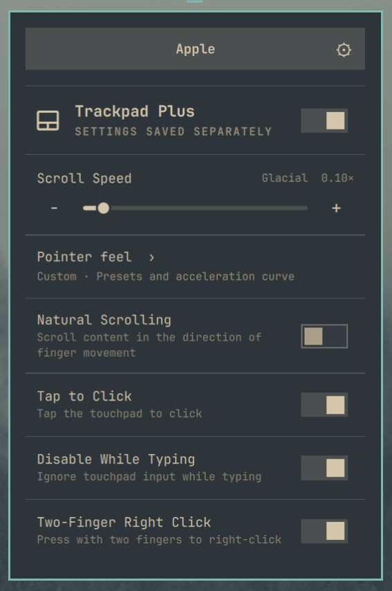
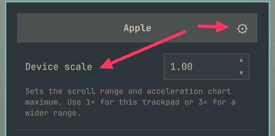
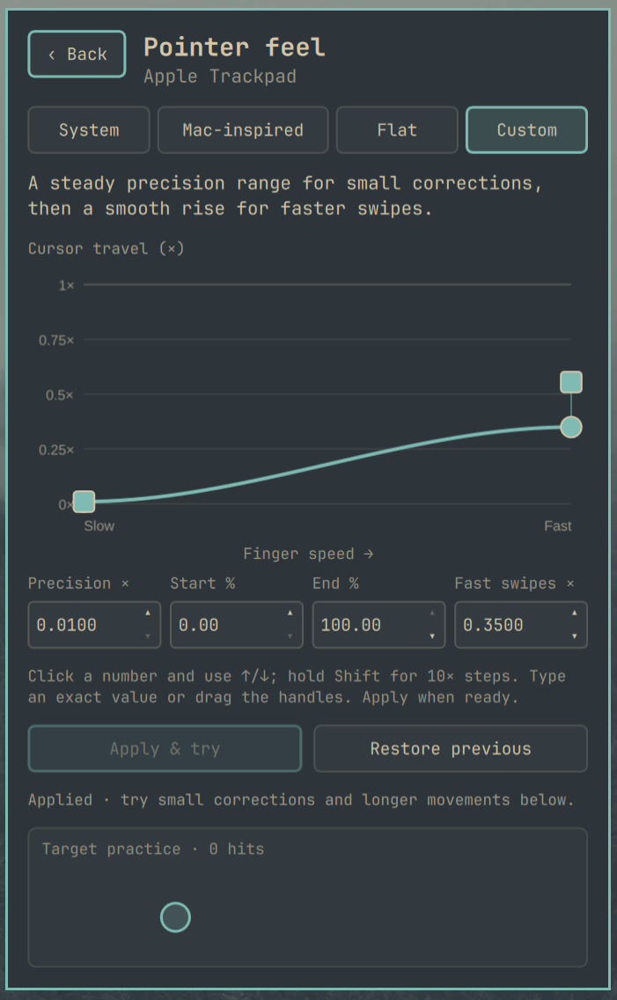

# Trackpad Plus for Omarchy

**Make your trackpad feel right.**

Fine-grained, per-device trackpad controls and pointer-feel tuning for
[Omarchy](https://omarchy.org). Independently maintained by David Fano;
not an official Omarchy project or endorsed by the Omarchy team.

## Project history

Trackpad Plus for Omarchy began as a fork of Andrew Kent’s
[omarchy-touchpad-widget](https://github.com/awkent01/omarchy-touchpad-widget).
It is independently maintained and has expanded to include per-device
controls, Apple trackpad support, and advanced pointer-feel tuning.
The original project and this derivative are licensed under the MIT License.

## Controls



- Enable or disable the selected trackpad.
- Scroll speed (0.01–1.00, in 0.01 steps) with a per-device scale, and pointer speed (−1.0–1.0).
- Pointer feel: System (adaptive), Flat, Mac-inspired, and Custom profiles.
- Visual acceleration editor with draggable precision, acceleration start/end, and fast-swipe
  handles, keyboard adjustment, target practice, and Restore previous.
- Natural scrolling, tap to click, disable while typing, and clickfinger behavior.
- Keyboard navigation through device selection, sliders, and switches.

Select a detected trackpad at the top. The switch beside **Trackpad Plus** turns
that trackpad on or off. **Natural Scrolling** controls scroll direction;
**Tap to Click** enables tapping instead of pressing; **Disable While Typing**
reduces accidental input while typing; **Two-Finger Right Click** enables a
secondary click by pressing with two fingers.

The sliders and toggles save as you use them. Pointer-curve edits stay in
preview until you press **Apply & try**.

The footer shows the installed version, starting with **2026.09.13.0**. Releases
use **YYYY.MM.DD.N**: release date followed by a revision starting at 0 and
increasing for additional releases that day. The screenshots below and above
were taken before the version footer was added.

The built-in Apple Silicon trackpad (`apple-mtp-multi-touch`) and Apple Magic
Trackpad interfaces share one set of Apple settings. The known
Dell touchpad is labeled Dell; other devices containing `touchpad` or `trackpad`
in their Hyprland name are listed by that name. Disconnected devices retain their
saved settings, and newly attached devices are discovered during state refreshes.
The Lenovo Synaptics `synaptics-tm3512-010` is also recognized despite lacking
either word in its name. Its separate TrackPoint is excluded. Other trackpads
whose names omit both words may still need an explicit detection rule.

## The top-right gear: Device scale



Click the **gear beside the trackpad name** to reveal **Device scale**. Click it
again to close the setting. This adapts the available range to the selected
trackpad's sensitivity. It defaults to **1×** and accepts **0.10–10.00×**.
There is no automatic Apple/PC multiplier.

The scale has two effects:

| Control | At 1× scale | At 3× scale |
| --- | --- | --- |
| Scroll Speed | A slider value of 0.50 sends 0.50× to Hyprland. | A slider value of 0.50 sends 1.50× to Hyprland. |
| Acceleration editor | The vertical chart range is 0–1×. | The vertical chart range is 0–3×. |

The scroll slider always runs from **0.01 to 1.00**. Its effective scroll factor
is **slider value × Device scale**. Increasing the scale changes scrolling
immediately when the value is committed. A less sensitive trackpad may benefit
from a wider range, such as 3×.

For the pointer curve, Device scale changes the chart range and gain controls.
**It does not multiply or overwrite your existing curve.** Adjust the curve and
press **Apply & try** to change pointer movement. If an existing curve exceeds
the chart range, the editor shows a notice and preserves its values. Pointer
Speed for System and Flat profiles is also unchanged by Device scale.

Type a scale and press Enter, or use Up/Down for **0.10** steps.
Shift+Up/Down uses **1.00** steps. The setting is saved for that device group.

Upgrading preserves effective scroll speeds: existing values up to 1 keep a 1×
scale, while values above 1 receive a matching scale. Schema 4 stores the
effective `scroll_factor` and separate `scroll_scale`; only the effective factor
is emitted to Hyprland. Back up both plugin and settings before upgrading;
downgrading requires restoring the matching settings backup.

## How pointer feel works



The graph connects **how fast your fingers move** to **how much the cursor
moves**. Left to right is slower to faster finger movement. Up and down is cursor
travel multiplier, or gain. Slower finger movement gives you finer corrections;
faster movement lets you cover more distance. The response follows finger speed,
not how close the cursor is to a button or target.

Choose **Custom** to adjust the curve, or **Mac-inspired** for a starting shape:

| Control | What it changes |
| --- | --- |
| **Precision ×** | Gain at the slow end. Lower values make small corrections finer. Drag the left circle vertically. |
| **Start %** | Where acceleration begins. Below this threshold, gain stays at the Precision value. Move the left square horizontally. |
| **End %** | Where acceleration reaches the Fast swipes value. Moving it right spreads the transition over a wider range of finger speeds. |
| **Fast swipes ×** | Gain at the fast end and beyond. Drag the right circle vertically. It cannot be lower than Precision. |

Start and End are relative positions on the graph, not physical speed units.
The two square handles control horizontal thresholds; the two circles control
gain. When End is at 100%, its square is offset vertically so it remains
separately clickable beside the fast-swipe circle.

Each value has an editable number spinner. Click the number and use Up/Down,
click its arrow buttons, or type a value and press Enter. Gain steps are
**0.001×**; threshold steps are **one percentage point**. Hold Shift with ↑/↓ for
10× steps: **0.01× gain** or **10 percentage points**. Typed values allow four
decimal places for gain and two for percentages. Gain can go down to **0.01×**.
Tab between controls; arrow keys also adjust a focused graph handle.

Press **Apply & try** to commit the draft, including a number you just typed,
then use the target-practice area for small corrections and longer movements.
**Restore previous** swaps back to the profile used before the last Apply on
that device, including after a restart. Applied settings persist across shell
restarts and Hyprland reloads. Escape returns to the main panel.

**System** uses libinput adaptive acceleration with your saved Pointer Speed.
**Flat** uses a constant response with that speed setting. In Custom and
Mac-inspired mode, the curve replaces Pointer Speed; its saved value is retained
for when you return to System or Flat.

The Mac-inspired preset is an experimental approximation. Its base curve uses
0.30× precision, Start at 20%, End at 70%, and 1.60× fast swipes. Choosing it with
a lower Device scale reduces both gains proportionally to fit: at 1× scale,
that gives 0.1875× precision and 1.00× fast swipes. Existing curves change only
when you explicitly apply an edit or preset. This editor does not add scroll
momentum or change gestures or haptic feedback.

<details>
<summary>How the curve reaches libinput</summary>

The backend converts the curve into 43 evenly spaced output-velocity samples
for libinput's native custom profile. The graph plots the response interpolated
from those same samples. Two samples beyond the visible graph keep fast swipes
at constant gain, including when End is 100%.

Each custom curve is validated with the installed libinput library before it
is applied or saved. Libinput accepts at most 64 points; Hyprland 0.56 does not
report point-validation failures through `hyprctl eval`, so the compositor's
response alone is insufficient. Custom profiles use an identity scroll curve
before the separate scroll multiplier. Legacy three-handle curves preserve
their intended shape during migration and appear as Custom.

</details>

## David's MacBook Air M2 settings

These are David Fano's settings for the **built-in MacBook Air M2 trackpad** as
of September 13, 2026, shown in the screenshots above. Use them as a starting
point and adjust for your display, trackpad, and preferred feel.

| Setting | Value |
| --- | --- |
| Trackpad | Enabled |
| Device scale | **1.00×** |
| Scroll Speed | **0.10** → effective **0.10×** |
| Pointer feel | **Custom** |
| Precision | **0.0100×** |
| Start | **0.00%** |
| End | **100.00%** |
| Fast swipes | **0.3500×** |
| Natural Scrolling | Off |
| Tap to Click | On |
| Disable While Typing | On |
| Two-Finger Right Click | On |
| Saved Pointer Speed | +0.6; used only with System or Flat |

This curve starts near 0.01× gain for slow corrections and rises smoothly to
0.35× for fast swipes. Start at 0% and End at 100% spread the transition across
the entire graph, with no initial constant-gain region. Scrolling is tuned
separately to 0.10×. To reproduce this setup, keep Device scale at 1.00, set
Scroll Speed to 0.10, choose Custom, enter the four curve values, and press
**Apply & try**. Set the toggles as listed above.

## Install and upgrade

Requires Omarchy's Quickshell shell and Lua-based Hyprland configuration
(tested with Hyprland 0.56.2), Python 3, libinput with custom acceleration support
(`libinput.so.10`), `hyprctl`, and GNU `timeout` (coreutils). No elevated privileges
are required. Older Hyprland configurations using `.conf` syntax are unsupported.

```sh
omarchy plugin add https://github.com/davefano/omarchy-trackpad-plus.git --enable
```

For an unattended installation, append `--yes`. The plugin ID is
`davefano.trackpad-plus`. Settings initialize automatically on the first state
read. Newly discovered devices are listed without generating overrides until
you make their first edit. That edit applies all shown settings for that device;
initial values come from global defaults and recognized legacy sensitivity rules,
so review them if you already have custom per-device configuration.
Existing saved Trackpad Plus settings remain active.
The widget appears when a supported trackpad is detected or remembered.

To upgrade an installed Git-managed copy:

```sh
omarchy plugin update davefano.trackpad-plus
omarchy restart shell
```

Back up local plugin edits before updating; develop in a separate checkout.

## Migrate from the original widget or local customization

The old IDs are `awkent01.touchpad` and `local.touchpads`. Keep only one trackpad
plugin enabled. First back up the installed plugin, shell layout, and state:

```sh
old_id=awkent01.touchpad  # Use local.touchpads for the earlier customization.
trackpad_backup="$HOME/.local/state/omarchy/backups/trackpad-plus-$(date +%Y%m%d-%H%M%S)"
mkdir -p "$trackpad_backup"
cp -a "$HOME/.config/omarchy/plugins/$old_id" "$trackpad_backup/"
cp -a "$HOME/.config/omarchy/shell.json" "$trackpad_backup/shell.json"
trackpad_state="${XDG_STATE_HOME:-$HOME/.local/state}/omarchy"
if test -d "$trackpad_state/local-touchpads"; then
  cp -a "$trackpad_state/local-touchpads" "$trackpad_backup/"
fi
if test -d "$trackpad_state/toggles/hypr"; then
  cp -a "$trackpad_state/toggles/hypr" "$trackpad_backup/hypr-toggles"
fi
omarchy plugin add https://github.com/davefano/omarchy-trackpad-plus.git --yes
omarchy plugin disable "$old_id"
omarchy plugin enable davefano.trackpad-plus --section right
omarchy restart shell
hyprctl reload
hyprctl configerrors
```

The old plugin remains installed for rollback. Do **not** delete the existing
state or generated Lua during migration. Trackpad Plus uses the same
`local-touchpads/settings.json` and `toggles/hypr/zz-local-touchpads.lua` paths,
including per-device curves and Restore previous. Recognized legacy per-device
sensitivity rules in `touchpad-settings.lua` are imported on first initialization.
Other device values initially inherit global touchpad defaults; arbitrary edits
from other configuration tools are not imported.

Update any keybindings or scripts that use the old IPC target. To roll back
without changing your current trackpad values:

```sh
omarchy plugin disable davefano.trackpad-plus
omarchy plugin enable "$old_id" --section right
omarchy restart shell
hyprctl reload
hyprctl configerrors
```

For an exact pre-migration restore, disable both plugins, restore the backed-up
plugin and `shell.json`, and copy the backed-up `local-touchpads` and
`hypr-toggles` files back to their original locations before restarting the shell
and reloading Hyprland. This also restores settings you changed after migration.
Keep the backup path printed by `echo "$trackpad_backup"`.

## IPC

```sh
omarchy-shell davefano.trackpad-plus open
omarchy-shell davefano.trackpad-plus close
omarchy-shell davefano.trackpad-plus toggle
omarchy-shell davefano.trackpad-plus show
omarchy-shell davefano.trackpad-plus hide
```

## Persistence and process behavior

Settings live under `$XDG_STATE_HOME` (default `~/.local/state`):

- `omarchy/local-touchpads/settings.json`: per-device values and previous profile.
- `omarchy/toggles/hypr/zz-local-touchpads.lua`: literal per-device rules loaded
  by Omarchy on Hyprland reload.

The historical filenames are intentional compatibility interfaces, independent
of the plugin ID. `trackpads.py` serializes operations with a file lock and
atomically replaces each file. Before a live edit, it records the previous state
in `local-touchpads/settings.pending.json`. Failed edits attempt rollback; if a
process is interrupted or rollback fails, the next read restores that snapshot.
An interrupted edit may therefore need to be applied again. Rolling back a
device's first edit uses `hyprctl reload config-only` to restore its original
configuration, without reloading monitors. Without a pending
edit, missing or inconsistent generated rules are rebuilt from saved JSON.
These files are not a single filesystem transaction; recovery requires writable
storage and a responding compositor.

State files must be regular files owned by your user, without hard links or
write access for other users. State directory paths must not contain symlinks
(the home directory itself is resolved first). Use an absolute `XDG_STATE_HOME`
pointing to real, privately writable directories. New files have mode 0600.
Unsupported state versions are rejected without migrating or overwriting them.

State reads have a 15-second deadline; writes have 10 seconds, followed by a
2-second forced-kill deadline. Timed-out actions release the queue and report an
error. Each compositor request also has a four-second deadline and a 1 MiB
output limit; lock acquisition has a two-second deadline. Consecutive slider
updates are combined and the pending action queue is limited to 128 entries.
Stale poll results are discarded after newer edits. The panel shows saved
settings; external configuration changes are not automatically imported.

Application-specific Hyprland `scroll_touchpad` window rules can override the
per-device scroll factor. If scrolling changes in some apps but not others,
check those rules in your configuration. The plugin does not rewrite window
rules or application settings.

## Development and testing

See [DEVELOPMENT.md](DEVELOPMENT.md) for the complete suite, architecture, and
live verification checklist. The [release safety review](docs/safety-review.md)
records tested failure cases and remaining compatibility limits. Report bugs through
[GitHub Issues](https://github.com/davefano/omarchy-trackpad-plus/issues).

## Removal

```sh
omarchy plugin remove davefano.trackpad-plus
```

Removal preserves settings and generated device rules. To stop applying those
rules while retaining a recoverable copy, move `zz-local-touchpads.lua` outside
the `toggles/hypr` directory and run `hyprctl reload`. Keep `settings.json` to
reuse your values on reinstall. Remove it only if you want fresh defaults.

## License

[MIT](LICENSE). Copyright 2026 Andrew Kent and David Fano. The complete original
commit history and Andrew Kent's copyright notice are preserved.
