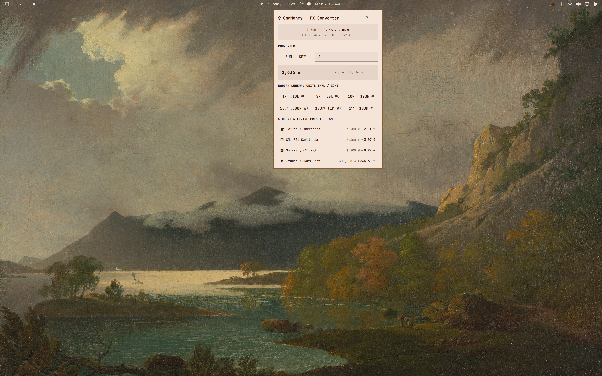
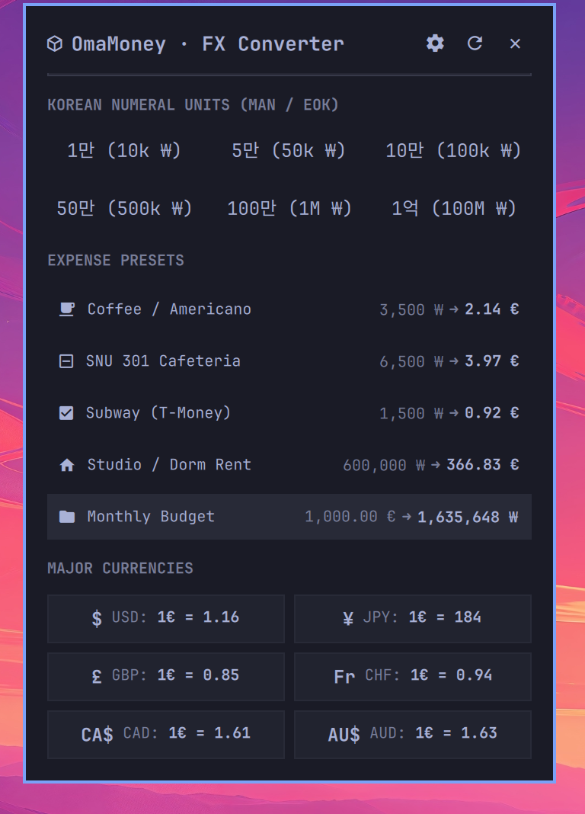

# OmaMoney

A live multi-currency exchange rate status bar widget and currency converter for Omarchy.




## Overview

OmaMoney brings real-time currency conversion directly to the Omarchy status bar. Designed for expats, international developers, and students, it provides instant live exchange rates, bidirectional conversions, and customizable expense presets while staying ultra-lightweight and integrated with your active theme.

## Gallery

| View | Preview |
| --- | --- |
| **Global Desktop** |  |
| **Converter Panel** |  |

## Features

- **Live Status Bar Pill**: Compact display on the Omarchy status bar showing real-time rates (e.g. `1 EUR = 1,635 KRW` or `1 USD = 159 JPY`).
- **Minimize to Cube Emoji (󰆧)**: Easily collapse the bar widget to show only the minimal cube emoji to save space, while retaining instant left-click access to the converter panel.
- **Multiple Bar Display Modes**: Cycle through 5 display modes (Standard rate, Unit rate, Expense sample, Compact target, or Minimized cube emoji only).
- **Interactive Quickshell Panel**: Fast bidirectional currency calculator with instant typing calculation.
- **Customizable Currencies**: Track any pair of world currencies (EUR, KRW, USD, JPY, GBP, CHF, CAD, AUD, and 160+ more).
- **Custom Expense Presets**: Define typical daily and monthly living expenses with custom amounts and icons.
- **Korean Numeral Units**: Built-in support for Korean denomination units (`만` / `억`).
- **Theme-Adaptive Design**: Native Quickshell vector styling that automatically harmonizes with your active Omarchy theme.
- **Offline Durability**: Hourly local caching ensures instant startup and full offline reliability.

## Installation

Install OmaMoney directly using the Omarchy plugin manager:

```bash
omarchy plugin add https://github.com/promaaa/omamoney.git --enable
```

### OR

1. Open the Omarchy menu (**Super + Alt + Space**).
2. Go to **Install > Plugins**.
3. Paste this repo URL: `https://github.com/promaaa/omamoney.git`
4. Hit Enter.

## Configuration

OmaMoney automatically watches `~/.config/omarchy/omamoney.json`. Any changes saved to this file hot-reload immediately without restarting the shell.

```json
{
  "baseCurrency": "EUR",
  "targetCurrency": "KRW",
  "barStyle": "standard",
  "minimized": false,
  "barMode": 0,
  "presets": [
    { "icon": "󰅶", "name": "Coffee / Americano", "amount": 3500, "isBase": false },
    { "icon": "󰛲", "name": "Lunch / Cafeteria", "amount": 6500, "isBase": false },
    { "icon": "󰄲", "name": "Subway / Transit", "amount": 1500, "isBase": false },
    { "icon": "󰋜", "name": "Studio Rent", "amount": 600000, "isBase": false },
    { "icon": "󰉋", "name": "Monthly Budget", "amount": 1000, "isBase": true }
  ],
  "majorCurrencies": [
    "USD",
    "JPY",
    "GBP",
    "CHF",
    "CAD",
    "AUD"
  ]
}
```

## Controls

| Action | Result |
| --- | --- |
| **Left Click** | Open/close the interactive currency converter panel |
| **Middle Click** | Instant toggle between full rate display and minimized cube emoji (`󰆧`) |
| **Right Click** | Cycle between 5 bar display modes (including minimized cube emoji mode) |
| **Header Eye Button** | One-click eye button (`󰈈` / `󰈉`) in panel menu to collapse/expand bar rates |
| **Settings Toggle** | Toggle "Show only cube emoji (󰆧)" switch in panel settings |

## Keybinding / CLI

Summon the converter panel or toggle minimized state from the terminal or Hyprland shortcut:

```bash
# Toggle converter panel
omarchy-shell shell toggle io.github.promaaa.omamoney

# Toggle minimized bar widget mode
omarchy-shell io.github.promaaa.omamoney toggleMinimized
```

## Contributing

Contributions, bug reports, feature requests, and suggestions are welcome. Feel free to open an issue or submit a pull request.

## License

This project is licensed under the MIT License. See the [LICENSE](LICENSE) file for details.
